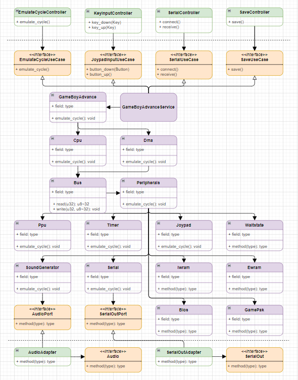

# Architecture

This project uses **Hexagonal Architecture (Ports & Adapters)**.

## Class Diagram



## Package Configuration

The package configuration represents that this project uses Hexagonal Architecture.

Users of this crate have to do two things: uses the "Controllers" and implement "Devices".

```sh
./src
├── adapter.rs
├── adapter
│   ├── in.rs
│   ├── in
│   │   ├── power_controller.rs
│   │   ├── emulate_cycle_controller.rs
│   │   ├── key_input_controller.rs
│   │   ├── serial_controller.rs
│   │   └── save_controller.rs
│   ├── out.rs
│   └── out
│       ├── audio_adapter.rs
│       ├── serial_out_adapter.rs
│       ├── audio_device.rs
│       └── serial_out_device.rs
├── application.rs
└── application
    ├── domain.rs
    ├── domain
    │   ├── service.rs
    │   ├── service
    │   │   └── gameboy_advance_service.rs
    │   ├── model.rs
    │   └── model
    │       ├── gameboy_advance.rs
    │       ├── cpu.rs
    │       ├── cpu
    │       │   ├── decode.rs
    │       │   ├── execute.rs
    │       │   ├── execute
    │       │   │   ├── arm_execute.rs
    │       │   │   └── thumb_execute.rs
    │       │   ├── instructions.rs
    │       │   ├── pipeline.rs
    │       │   └── registers.rs
    │       ├── bus.rs
    │       ├── peripherals.rs
    │       ├── ppu.rs
    │       ├── sound_generator.rs
    │       ├── timer.rs
    │       ├── joypad.rs
    │       ├── serial.rs
    │       ├── ewram.rs
    │       ├── iwram.rs
    │       ├── bios.rs
    │       └── game_pak.rs
    ├── port.rs
    └── port
        ├── in.rs
        ├── in
        │   ├── power_usecase.rs
        │   ├── emulate_cycle_usecase.rs
        │   ├── joypad_input_usecase.rs
        │   ├── serial_usecase.rs
        │   └── save_usecase.rs
        └── out.rs
        └── out
            ├── audio_port.rs
            └── serial_out_port.rs

```
